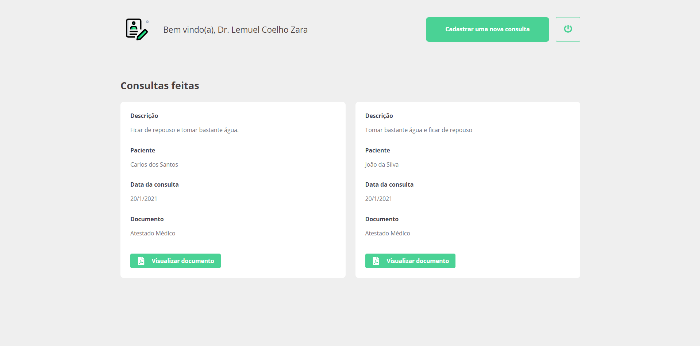
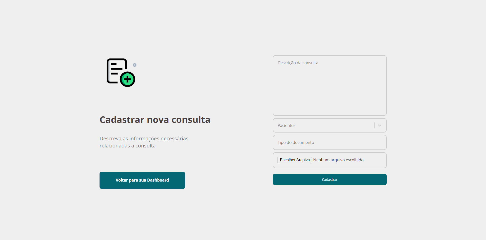
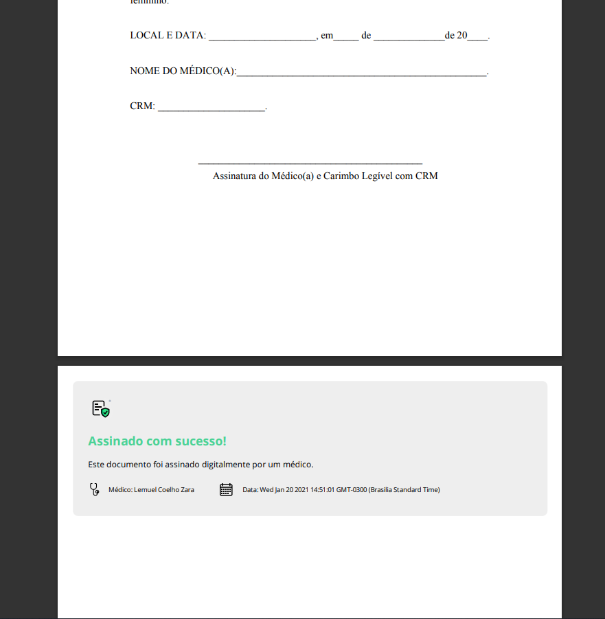

<h1 align="center">CertMED</h1>

Um protótipo de software web para assinatura digital e autenticação de documentos médicos.

 

Projeto desenvolvido para o TCC de Análise e Desenvolvimento de Sistemas do IFSP - Campus Votuporanga

 

